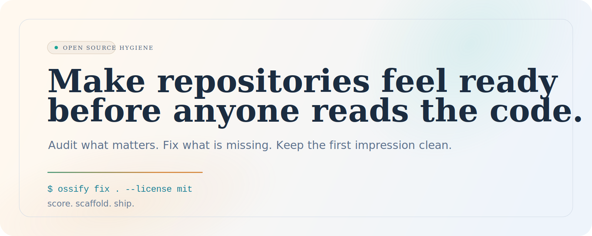
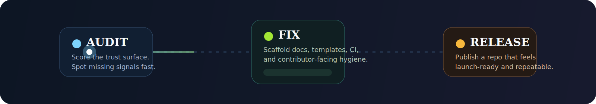

<p align="center">
  <picture>
    <source media="(prefers-color-scheme: dark)" srcset="./assets/brand/hero-dark.svg">
    <source media="(prefers-color-scheme: light)" srcset="./assets/brand/hero-light.svg">
    
  </picture>
</p>

<h1 align="center">ossify</h1>

<p align="center"><strong>Turn rough repositories into projects people trust at first glance.</strong></p>

<p align="center">
  Audit the public face of a repo, score what matters, then scaffold the missing trust signals before launch day.
</p>

<p align="center">
  <a href="https://github.com/zay168/ossify/stargazers"></a>
  <a href="https://github.com/zay168/ossify/blob/main/LICENSE"></a>
  <a href="https://www.rust-lang.org/"></a>
  <a href="https://github.com/zay168/ossify/actions/workflows/ci.yml"></a>
  
</p>

<p align="center">
  <code>ossify audit .</code>
  <span>&nbsp;&nbsp;->&nbsp;&nbsp;</span>
  <code>ossify fix . --license mit --owner "Acme Maintainers"</code>
</p>

> Most repositories do not need more configuration. They need a better first impression.

## The pitch

`ossify` is for maintainers who want their project to look serious fast.

It does not try to be a monolithic platform. It focuses on the layer people actually judge in the first minute:

- is there a clear license
- can contributors understand the rules of the road
- do issue and PR templates create signal instead of chaos
- does the repo feel maintained, shippable, and safe to touch

That makes `ossify` an easy open source sell:

- solo maintainers get an instant polish pass
- teams can standardize repository hygiene across stacks
- bots and CI can consume the JSON output
- GitHub releases can ship ready-to-download binaries

<p align="center">
  
</p>

## Why it feels different

| Credibility layer | Contributor runway | Shipping signal |
| --- | --- | --- |
| README, license, security policy, changelog, code of conduct | Contributing guide, issue templates, PR template | CI workflow, release packaging, JSON output for automation |

| Opinionated enough to help | Light enough to trust | Brand-ready |
| --- | --- | --- |
| The score makes missing pieces obvious without drowning maintainers in noise. | The generated files are readable starter docs, not generic placeholder sludge. | The README, CLI output, and release workflow already position the repo like a product. |

## Day-one transformation

| Before `ossify` | After `ossify fix` |
| --- | --- |
| Repo looks promising but unfinished | Repo looks intentional and contributor-friendly |
| Important trust files are missing | Core health files are scaffolded in one pass |
| Manual copy-paste from old projects | Consistent repository setup you can repeat |
| Hard to automate in CI | `--json` output fits bots and policy checks |

## Commands

```text
ossify audit [path]
ossify init [path] [--overwrite] [--license mit|apache-2.0] [--owner "Your Name"]
ossify fix [path] [--overwrite] [--license mit|apache-2.0] [--owner "Your Name"]
ossify version
ossify help
```

Global flags:

```text
--json
--color
--no-color
```

If you run `ossify` without arguments, it audits the current directory.

## A taste of the output

```text
> ossify audit .

OSSIFY REPORT
Target: .
Open source readiness score: 47/100

Healthy
  [ok] README (+15)
  [ok] License (+20)
  [ok] Project manifest (+5)

Missing or weak
  [missing] Contributing guide (+10, autofixable)
           Document the workflow for contributors and new maintainers.
  [missing] Code of conduct (+10, autofixable)
           Signal healthy community standards from day one.
  [missing] Security policy (+10, autofixable)
           Tell users how to report vulnerabilities responsibly.
  [missing] Issue templates (+8, autofixable)
           Issue templates raise bug report quality fast.
  [missing] Pull request template (+7, autofixable)
           A good PR template keeps reviews focused.
  [missing] CI workflow (+7, autofixable)
           Automation increases confidence in the project.

Next move
  ossify fix . --license mit --owner "Acme Maintainers"
```

```text
> ossify fix . --json

{"command":"fix","target":"C:\\repo","before_score":47,"after_score":95,"score_delta":48}
```

## What gets scaffolded

- `README.md`
- `LICENSE`
- `CONTRIBUTING.md`
- `CODE_OF_CONDUCT.md`
- `SECURITY.md`
- `CHANGELOG.md`
- `.github/ISSUE_TEMPLATE/bug_report.md`
- `.github/ISSUE_TEMPLATE/feature_request.md`
- `.github/PULL_REQUEST_TEMPLATE.md`
- `.github/workflows/ci.yml`

## Release-ready by default

This repo ships with:

- a CI workflow for `cargo check` and `cargo test`
- a release workflow that packages binaries for Linux, macOS, and Windows
- a README built like a product page, not a scratchpad

Once Rust is installed:

```bash
cargo build
cargo run -- audit .
cargo run -- fix . --license mit --owner "Acme Maintainers"
```

## Roadmap

- `ossify fix --check` for CI gatekeeping without writing files
- presets for libraries, CLIs, SDKs, and SaaS repos
- README score badges for proud maintainers
- GitHub and GitLab-specific hygiene packs
- AI-assisted README and release note refinement

## Brand kit

The README artwork lives in [`assets/brand`](./assets/brand):

- theme-aware animated hero banners
- an animated pipeline strip
- a visual foundation that can be reused for a future landing page or social preview

## Notes

This workspace did not have Rust installed when the project was scaffolded, so the code has been authored but not compiled locally yet.
